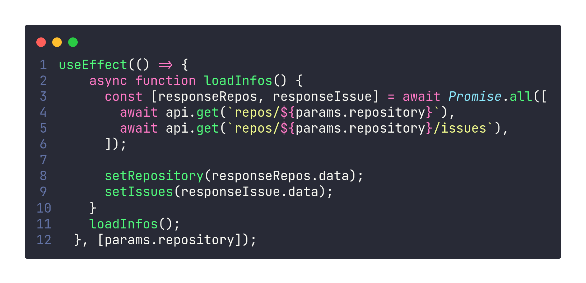
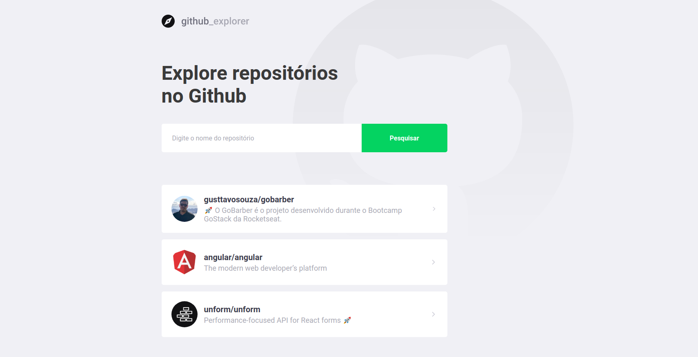

  

## 👨🏼‍💻 Projeto

Projeto com intuito de buscar informações no GitHub e disponibilizar em um outra interface gráfica. Foi feito para relembrar alguns dos conceitos trabalhados no GoStack.

## ⁉️ Destaque
Por ser um projeto que foi refeito, foi interessante para relembrar um conceito que não utilizava á algum tempo, que no caso foi a utilização do `Promise.all()`, comando que permite diversas requisições (ou tarefas assíncronas) serem feitas ao mesmo tempo, sem que uma dependa da outra.

## 🔨 Tecnologias

- JavaScript
- ReactJs

## 🔄 Executar

### 💻 Front-end
  - Entrar na pasta `frontend`;
   - Executar `yarn install` para instalar dependências do projeto;
   - Executar `yarn start` para que o projeto seja executado;

## 🖥️ Interface

## 📝 Licença
Este projeto está sobre a licença MIT. Veja o arquivo [LICENSE](LICENSE.md) para mais detalhes.
